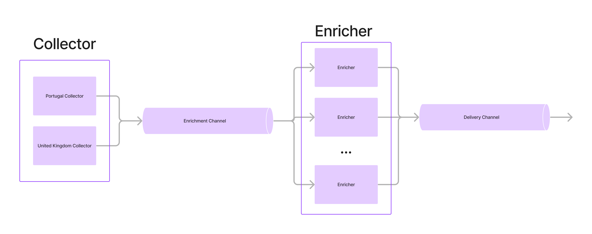

[](https://github.com/buarki/find-castles/actions)

# find castles


## I Just Want To Run It

Using Makefile:

```sh
make run
```

Directly using go:

```sh
PORT=8080 go run --race cmd/standalone/*.go
```

Then access http://localhost:8080 on your browser.


## What Is This Project?

### Summary
This project demonstrates the use of [Server-Sent Events (SSE)](https://developer.mozilla.org/en-US/docs/Web/API/Server-sent_events/Using_server-sent_events) to interact with a Go application. When users access the web client, they find a "Search" button that, when clicked, initiates a **data pipeline** on the Go server. This pipeline involves [web scraping](https://www.imperva.com/learn/application-security/web-scraping-attack/#:~:text=Web%20scraping%20is%20the%20process,replicate%20entire%20website%20content%20elsewhere.) from various sites to gather information about castles, including their names, and the country and city where they are located. The server sends these details back to the client in real time via SSE, allowing users to see the results as they are processed.

### The Data Pipeline

The search data pipeline is controlled by the [findCastles function](./cmd/find_castles.go) and it has three stages:
- Collecting castles to enrich data;
- Enrich the collected castles;
- Send the castles to frontend as they are enriched;

The **collecting stage** by now collects castles from the United Kingdom and Portugal. We may think about theses countries as **collecting sources**. The collecting process goes by: for each collecting source it access a web page having the list of castles and then it extracts a list of the castles with its respective link. The collected castles are merged into a single channel and are passed to next stage for enrichment, take a look at the [collector](./collector/collector.go).

The **enrichment stage** receives the castles as they are sent by the collecting stage an access their info web page to extract detailed data, like the city, state and district. As this stage has more jobs to be done we scale the [enrichment job](./enricher/enricher.go) by the number of available CPUs on the machine. The enriched castles are then converged into a single channel to be consumed by the last stage.

The last stage just listens to the channel with enriched castles and sends them to the web app through the open SSE connection, you can check it [here](./cmd/main.go).

Bellow image illustrates how it works:



### Countries Supported Now

|Country|Source web site|
|--|--|
| United Kingdom|https://medievalbritain.com/category/type/medieval-castles/|
| Portugal|https://www.castelosdeportugal.pt/|
| Ireland|https://heritageireland.ie/visit/castles/|
| Slovakia|https://www.ebidat.de/cgi-bin/ebidat.pl?a=a&te53=7;|

## Architectural Decision Records

Find it [here](./docs/adr/index.md);
