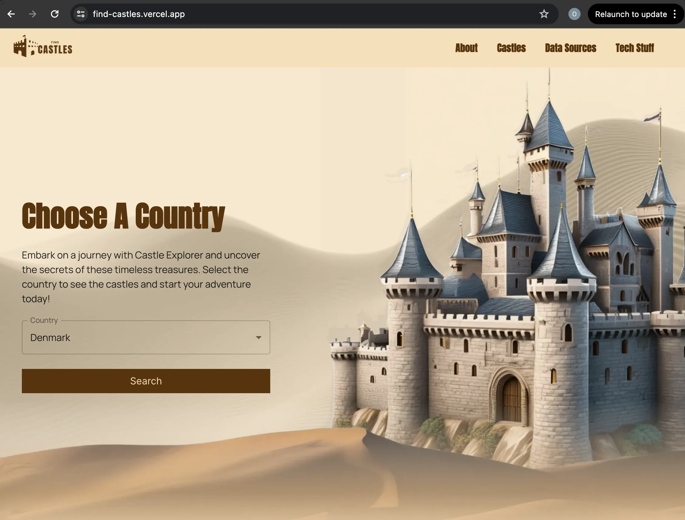

[](https://github.com/buarki/find-castles/actions/workflows/tests.yml)
 [](https://find-castles.vercel.app/) [](https://github.com/buarki/find-castles/actions/workflows/collect-and-enrich-castles.yml)


# find castles

Standalone version running:


Website deployed:



Visit it deployed [here](https://find-castles.vercel.app/).


## I Just Want To Run It

Make sure you have following tools:
- Go >= 1.22.2;
- Node >= 20.0.0;
- (Make) Makefile >= 3.81;
- Docker >= 25.0.3;
- Docker-compose >= v2.24.6;

To run the standalone version locally follow bellow steps:

Using Makefile:

```sh
make run
```

Directly using go:

```sh
PORT=8080 go run --race cmd/standalone/*.go
```

Then access http://localhost:8080 on your browser.

If you want to perform the enrichment on your local environment and see the website follow theses steps:
- turn on MongoDB using docker-compose;

```sh
make db_up
```

- run enricher;

```sh
make run_enricher
```

- run the website;

```sh
make run_site
```

Then you can access the site at [http://localhost:3000](http://localhost:3000).


## What Is This Project?

### Summary

This project was created to demonstrate the usage of [Server-Sent Events (SSE)](https://developer.mozilla.org/en-US/docs/Web/API/Server-sent_events/Using_server-sent_events) in Go application. When users access the web client, they find a "Search" button that, when clicked, initiates a **data pipeline** on the Go server. This pipeline involves [web scraping](https://www.imperva.com/learn/application-security/web-scraping-attack/#:~:text=Web%20scraping%20is%20the%20process,replicate%20entire%20website%20content%20elsewhere.) from various sites to gather information about castles, including their names, and the country and city where they are located. The server sends these details back to the client in real time via SSE, allowing users to see the results as they are processed.

Rethinking this project I transformed it into an open data project to collect and consolidate data about european castles and make it available.

## Enrichment Data Pipeline

The enrichment process has 3 main stages.

**In the first stage** it iterates through know sources of castles (web pages) and scrap the received HTML to collecting links containing the data we want to extract. For now we use the following websites as sources of data:

- [Medieval Castles](https://medievalbritain.com/category/type/medieval-castles/);
- [Castelos de Portugal/Castles From Portugal](https://www.castelosdeportugal.pt/);
- [Heritage Ireland](https://heritageireland.ie/visit/castles/);
- [EBIDAT](https://www.ebidat.de/cgi-bin/ebidat.pl);


For each of the above source we have an **Enricher** implemented which is able to interact with the website. Such enrichers must follow the Enricher interface that you can check [here](./enricher/enricher.go). This first step is implemented by the *CollectCastlesToEnrich* method and one concrete example of implementation is [the one from Portgual](./enricher/castelosdeportugal.go).

All the enrichment sources are defined in the enricher entrypoint as the bellow map:

```go
enrichers := map[enricher.Source]enricher.Enricher{
  enricher.CastelosDePortugal: enricher.NewCastelosDePortugalEnricher(httpClient, htmlfetcher.Fetch),
  enricher.EDBIDAT:            enricher.NewEbidatEnricher(httpClient, htmlfetcher.Fetch),
  enricher.HeritageIreland:    enricher.NewHeritageIreland(httpClient, htmlfetcher.Fetch),
  enricher.MedievalBritain:    enricher.NewMedievalBritainEnricher(httpClient, htmlfetcher.Fetch),
}
```

Those enrichers runs concurrently and controlled by the [executor package](./executor/executor.go), and as the links to collect castle data are received, they are passed to the next pipeline stage through a channel.

**The second stage** visits the received links and scrapes data from the HTML to collect the info we need. One concrete example can be seen by checking the the implementation of method EnrichCastle for the [Heritage Ireland](./enricher/heritageireland.go) data source.

Once the castle struct is filled with collected data, it is sent to third stage through a channel.

**The third stage** receives the enriched castle and if the program detects that there is already info saved for that castle a reconciliation is performed based on the presence of some key and mandatory fields, like name, city and district.

Those reconciled data castles are then consolidated into a buffer of configurable size and once the buffer is full they are saved into MongoDB in a bulk operation to avoid multiple writes against the DB.

### Countries Supported Now

|Country|Source web site|
|--|--|
| United Kingdom|https://medievalbritain.com/category/type/medieval-castles/|
| Portugal|https://www.castelosdeportugal.pt/|
| Ireland|https://heritageireland.ie/visit/castles/|
| Slovakia|https://www.ebidat.de/cgi-bin/ebidat.pl?a=a&te53=7;|
| Denmark|https://www.ebidat.de/cgi-bin/ebidat.pl?a=a&te53=2;|

## Architectural Decision Records

Find it [here](./docs/adr/index.md);

## Enrichment Sources

- [Castelos de Portugal](./docs//enrichment-sources/castelosdeportugal.md);
- [Medieval Britain](./docs/enrichment-sources/medievalbritain.md);
- [Heritage Ireland](./docs/enrichment-sources/heritageireland.md);
- [EBIDAT](./docs/enrichment-sources/ebidat.md);
